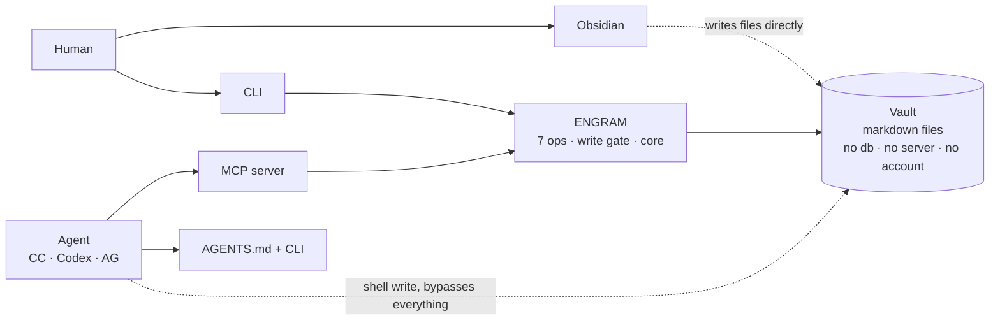
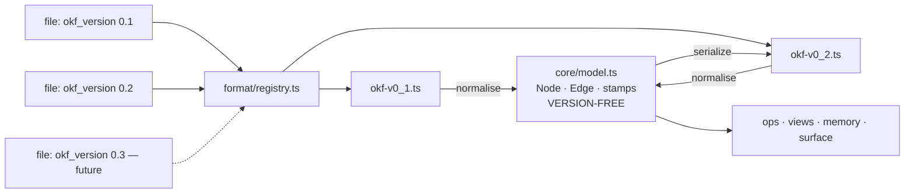
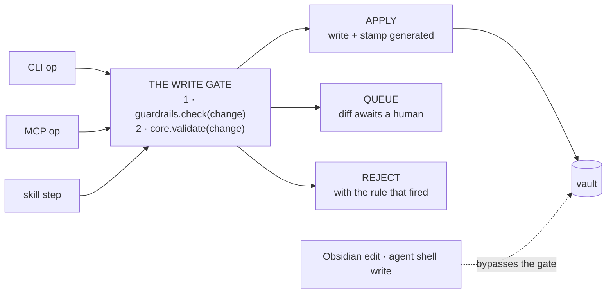
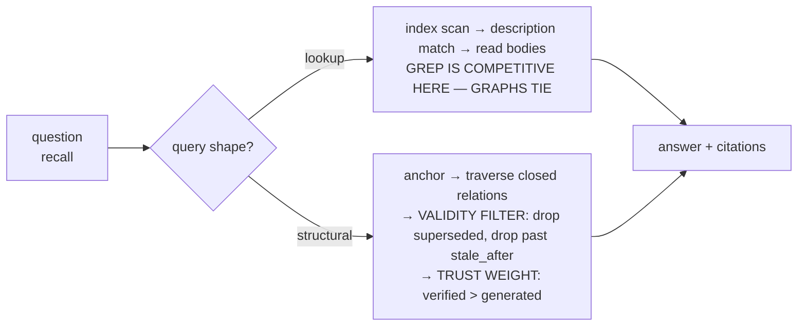
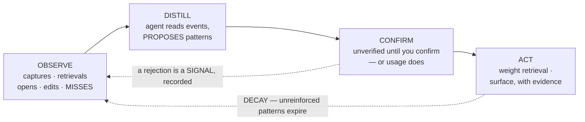

# Engram — Architecture Overview (v2)

> **Status**: canonical as of 2026-08-10 — supersedes [`overview.md`](overview.md)
> **Decisions**: [ADR-0018](../decisions/0018-product-definition.md) … [ADR-0036](../decisions/0036-intelligence-loop.md)
> **Constitutional (Rule 10)** — read as a stable reference during phase work.
> Log gaps as `[ARCH_CHANGE]` in phase history; amend here only via `/sync-docs`.

Seven operations over two primitives, one write gate, one version-free model
behind swappable codecs — and everything else (skills, guardrails, views,
surfaces, intelligence) layered outside a core that does not know it exists.

---

## 1. System context — including the bypass

Engram mediates **two of the four write paths**. Obsidian edits files directly by
design; an agent with a shell can do the same. Any control that exists only at
engram's gate is therefore *advisory* for the other two — which is why guardrails
come in two kinds (§7).



---

## 2. Modules, ports, and codecs

The module tree **is** the three-tier architecture
([ADR-0024](../decisions/0024-three-tier-dependency-inversion.md)), so a wrong
import shows up in a diff.

```
src/
├── core/              # TIER 1 — invariant. version-free. no I/O.
│   ├── model.ts         Node · Edge · assertion stamps — ENGRAM'S model
│   ├── ports.ts         FileStore · Detector · Clock — narrow, segregated
│   ├── relations.ts     the closed-set registry (not a switch)
│   └── graph.ts         identity · traversal · validity — pure, in-memory
│
├── format/            # codecs. ONE FILE PER SPEC VERSION. additive.
│   ├── okf-v0_1.ts      reader + writer
│   ├── okf-v0_2.ts      reader + writer
│   └── registry.ts      detect version → select codec
│
├── ops/               # the seven operations, composed from core
│   ├── capture.ts  format.ts  promote.ts  link.ts
│   └── recall.ts   reindex.ts  doctor.ts
│
├── gate.ts            # every write in the system passes through here
│
├── policy/            # TIER 2 — Agency
│   ├── guardrails.ts    preventive at the gate; detective in doctor
│   └── skills.ts        load · resolve · expose to the agent
│
├── memory/            # TIER 2 — the intelligence layer (§10)
│   ├── observe.ts       append-only event log
│   └── distill.ts       events → proposed patterns
│
├── views/             # TIER 2 — Structure
├── surface/           # TIER 2 — cli · mcp · agents-md
└── substrate/         # TIER 3 — implements core/ports.ts
    ├── fs.ts  detect.ts  clock.ts
```

### Two rules, both enforceable by lint

1. **`core/` may import nothing but `core/`.**
2. **Nothing above `format/` may see format-shaped data.**

### Why the format sits outside the core

Per [ADR-0032](../decisions/0032-internal-model-versioned-codecs.md): a
`core/okf.ts` would be *edited on every spec release* (open/closed) and would make
the core depend on **an external YAML schema governed by someone else's release
cycle** (dependency inversion).



**Adding a spec version is adding a file.** If a future OKF cannot express
something the model holds, that is a codec-level lossy warning — not a change to
the core. Migrating a vault between versions is one transform through the internal
model, not a rewrite.

### Ports, not a substrate (interface segregation)

| Port | Used by | Stubbed in tests as |
|---|---|---|
| `FileStore` | ops, views, memory | an in-memory map |
| `Detector` | surface, doctor | a fixed fact set |
| `Clock` | model stamps, staleness | a fixed instant |

`core/` *names* these interfaces; `substrate/` implements them. The core is
exercisable entirely in memory — no temp directories, no fixtures, no clock flake.

---

## 3. The data model on disk

No database. A node is a file; an edge is a line of YAML.

```markdown
---
type: Decision                                   # free vocabulary — never read by engram
title: Retrieval goes hybrid
description: Graph-only was too slow on lookups, so we route by query shape.
tags: [retrieval, architecture]                  # free
id: hybrid-retrieval                             # IDENTITY — stable across moves
aliases: [/inbox/2026-06-14-retrieval.md]        # repair trail, written on move
timestamp: 2026-06-14T09:22:00Z
status: stable                                   # OKF v0.2
stale_after: 2027-06-14                          # OKF v0.2
generated: { by: claude-opus-5, at: 2026-06-14T09:22:00Z }
verified: [ { by: avinash, at: 2026-06-14T18:40:00Z } ]
sources:                                         # CLOSED RELATION — lineage
  - resource: https://arxiv.org/abs/2501.13956
  - id: /concepts/graph-rag.md
supersedes: /decisions/2026-03-02-graph-rag-only.md   # CLOSED RELATION
---

# Decision
Route by query shape. Multi-hop goes to traversal; single-fact goes to lookup.

# See also
- [Graph RAG](/concepts/graph-rag.md)            # body link — untyped, human-facing
```

**Two channels, on purpose** ([ADR-0022](../decisions/0022-relations-in-frontmatter.md)):

| Channel | Carries | Read by | Obsidian |
|---|---|---|---|
| Body links | untyped association | humans, graph view | yes — graph edges |
| Frontmatter relations | the closed set (`supersedes`, `sources`) | engram's retrieval | yes — properties |
| Frontmatter free fields | `type`, `tags`, anything | user, agent | yes — properties |

Both are plain text, so a wrong one costs seconds to fix — load-bearing for the
agent-error mitigation in §7.

---

## 4. Seven operations

| Op | Does | Writes | Through the gate |
|---|---|---|---|
| `format(content, hints)` | **The agent's main verb.** Content → node(s) + relations. Content from anywhere: stdin, a paste, a URL, prose the agent holds, a file. | yes | **yes** |
| `capture(content)` | Persist raw content to `inbox/`. Never validates, never fails. A **durability step**. | yes | no — inbox is not the vault |
| `promote(path)` | `format` with content read from an inbox file. Not a distinct concept. | yes | **yes** |
| `link(a, b, kind)` | Assert a relation. `supersede` is `link` with a closed type. | yes | **yes** |
| `recall(question)` | Answer by navigating and traversing (§9). | no | — |
| `reindex()` | Regenerate all derived state. | derived only | no — derived is disposable |
| `doctor()` | Health, integrity, detective guardrails. | only `--fix` | yes, when fixing |

> **There is no `capture → format → promote` pipeline**
> ([ADR-0033](../decisions/0033-format-takes-content.md)). When the user says
> *"here are my raw notes, format these"*, the content is already in the agent's
> context — there is no file and nothing to capture. The shape is
> `content (from anywhere) → format → [gate] → nodes`, and **`inbox/` is a buffer,
> not a stage**.

`init` and `skill` are meta-commands: one scaffolds, the other sequences the seven.

---

## 5. The write gate

Every write converges on one function. That choke point is what makes guardrails
implementable — otherwise policy is re-checked in seven places and missed in one.



**A change is a proposed diff, not a file write.** That framing is what makes
`QUEUE` possible, lets a rejection name the exact rule that fired, and makes
dry-run free rather than a special mode.

---

## 6. Skills

A skill is a packaged way of *using* the vault — connect twelve sources, write the
weekly digest, turn research into a feature plan.

> **A skill is instructions, never code. It can only *sequence* the seven
> operations — it can never add an eighth.**

So the blast radius of a bad, careless, or downloaded skill is bounded by what the
operations already permit, and every step still passes the write gate.

```markdown
.engram/skills/connect-the-dots.md

---
name: connect-the-dots
description: Read a set of pointers, find the shared thread, emit one synthesis node.
uses: [capture, format, link]        # which ops it may sequence
emits:
  type: Synthesis
  relations: [sources]               # what it produces, declared up front
guardrails: [require-sources, propose-only]   # MAY TIGHTEN — never loosen
---

# When to use
The user drops several articles, videos or repos and asks what they add up to.

# Steps
1. Read each pointer. If a pointer has no body, summarise it into `sources/` first.
2. Separate claims that recur, claims that conflict, claims unique to one source.
3. Emit ONE node with `sources:` listing every input that contributed.
4. Never assert a claim no source supports. If you infer, say so in the body.
```

A skill **cannot** touch the filesystem, add operations, loosen guardrails, or
reach the network. Built-ins ship with engram; vault-local skills live in
`.engram/skills/` and travel with a `git clone`. On collision, vault-local wins.

---

## 7. Guardrails — preventive and detective

Write-time autonomy is what makes the product work. Guardrails are the
counterweight. Because §1 shows engram mediates only some writes, a single
enforcement point would be a false promise.

| | Runs at | Catches |
|---|---|---|
| **Preventive** | the write gate | engram-mediated writes **only** |
| **Detective** | `doctor` | **every write, however it happened** |

> **Design every rule so it has a detective form.** A rule enforceable only
> preventively is advisory, and advisory controls on a shared filesystem are a
> comfort, not a control. If it cannot be detected, do not claim it is enforced.

```markdown
.engram/guardrails.md

# Always
no-delete                  deprecate, never remove. supersession invalidates.
require-sources            a Synthesis node must carry >= 1 sources entry
no-supersede-verified      cannot supersede a human-verified node unattended

# Scoped
propose-only               paths: [decisions/**]
path-scope                 allow: [inbox/**, concepts/**, sources/**, projects/**]
rate-limit                 max: 20 new nodes per run
```

| Rule | Failure it prevents | Detective form |
|---|---|---|
| `require-sources` | an unauditable synthesis claim you act on months later | scan `Synthesis` nodes with no `sources` |
| `no-delete` | losing the record of what you used to believe | diff node count against the log |
| `no-supersede-verified` | an agent overruling a human judgement silently | find `supersedes` targets carrying `verified` |
| `rate-limit` | a large, well-formatted pile you never reviewed | count `generated.by` per day |
| `propose-only` | autonomous writes where stakes are highest | find nodes in scoped paths with no `verified` |
| `path-scope` | an agent reorganising things it shouldn't touch | find `generated` nodes outside the allowed set |

---

## 8. Trust boundaries — what leaves the machine

> **Engram never transmits anything.** No account, no telemetry, no network calls.
> Stronger than any encryption feature it could ship, and free to maintain because
> it is structural ([ADR-0034](../decisions/0034-encryption-is-a-substrate-concern.md)).

Engram ships **no encryption**, because **an encrypted note is a note engram
cannot help with** — opaque to retrieval, relation extraction, validity filtering,
and views. Encrypting a note is functionally deleting it from the system.

| Threat | Correct answer | Owner |
|---|---|---|
| Stolen or lost device | Full-disk encryption (FileVault / LUKS / BitLocker) | OS — already on, free |
| Remote copy at rest | Private repo; encrypted remote | forge / host |
| A few specific paths | `git-crypt` / `age`, *accepting those files leave the graph* | user, explicitly |
| Third-party servers | **Engram has none** | architecture |

### The threat that actually changed

**In an agent-native product, the agent is a network egress path.** When an agent
reads the vault, content goes to a model provider — encryption at rest is
irrelevant to it. Answers, in order of effectiveness:

1. **[ADR-0030](../decisions/0030-boundaries-are-repos.md)** — the private vault is
   a separate repository the working agent has no reason to be in. *The real control.*
2. A local model for that vault when quality permits. The architecture permits it
   because engram has no opinion about which agent is used.
3. `path-scope` — preventive-only, does not bind an agent with a shell.

> If engram ever gains a network call — telemetry, a hosted index, a sync service —
> this section must be revisited first.

---

## 9. The read path

One entry point, two routes. The routing decision is the payoff of Gate 1
([ADR-0031](../decisions/0031-evidence-gates-before-graph.md)) — you cannot route
by query shape until you know the shapes exist.



**The validity filter is the thing grep cannot do.** Text search has no concept of
*still true* — it returns the March decision and the June decision with equal
confidence. This is where the closed relation set and OKF v0.2's trust signals pay
for themselves.

**Every query, and every miss, is logged** — see §10. A miss is the most valuable
thing in that log.

---

## 10. Intelligence — the second store and the loop

Roam cannot tell you a note is stale — it never knew *when it was true*. Obsidian
cannot tell you two notes conflict — its links are untyped. Notion cannot tell you a
claim is unsupported — it has no provenance.

> **Intelligence is downstream of the metadata, not a module bolted beside it.**

### Two stores, one set of primitives

| | Knowledge memory (the vault) | User memory (`.engram/memory/`) |
|---|---|---|
| About | the world, the work | **the user** |
| Written by | user + agent | **engram, from observation** |
| Shared with a team | yes | **never** |
| Synced | usually | gitignored by default |
| Deleting it costs | knowledge | **only inference — safe by construction** |

Per [ADR-0035](../decisions/0035-user-memory-second-store.md), user memory needs
**no new primitives**: an observation is a Node; a **pattern is a Node whose
`sources` point at the observations supporting it**, so *"why do you think that?"*
is answerable by following an edge. High-volume events go to
`.engram/memory/events/*.jsonl`; only distilled patterns become nodes.

*That this required no new primitives is the strongest evidence
[ADR-0019](../decisions/0019-node-edge-primitives.md)'s reduction was correct.*

### The loop



**No new fields.** `OBSERVE → events/*.jsonl` · `DISTILL → format + the write gate` ·
`CONFIRM → verified: [{by, at}]` · `ACT → retrieval trust-weighting` ·
`DECAY → stale_after · status: deprecated · supersedes`.

### What is worth inferring

Ranked by *would a correct answer change what the user does* — not by how it sounds.

| # | Inference | Why it matters | Needs |
|---|---|---|---|
| 1 | **Retrieval gap** | You asked; the vault couldn't answer. The best input to *what should I write next*. | **a log — no model** |
| 2 | **Re-derivation** | The agent answered from scratch while the vault held it. A *retrieval* failure, not a knowledge gap. | **a log — no model** |
| 3 | **Contradiction** | Two nodes assert incompatible things, neither supersedes. Hard for a human, easy for the graph. | graph + `contradicts` |
| 4 | **Staleness × intent** | Not "this is old" — *"you are about to build on a node whose sources are 14 months old and superseded upstream."* | time + lineage |
| 5 | **Dead weight** | Most captures are never retrieved. Knowing which fifth you use changes what you capture. | log + retrieval history |
| 6 | **Rhythm & context** | Surfacing notes ahead of an event. Real — and the **least differentiated**. Ranked last because it demos best. | connectors — *scope risk* |

**The top two need no model.** They need a log nobody keeps — and Phase 7's Gate 1
instrumentation *is* that log, so one build serves two purposes.

> **A proactive system that is wrong is worse than none, because it teaches the
> user to ignore the tool.** Constraints
> ([ADR-0036](../decisions/0036-intelligence-loop.md)): proposals never facts ·
> every recommendation **cites its evidence**, and an unciteable one is not shown ·
> rejection is recorded · hard ceiling on interruptions · observation on by default,
> proaction opt-in · Rule 11 evaluator locked before the loop is built.

Item 6 — calendars, events, feeds — is where engram stops being a knowledge system
and starts competing with much larger productivity incumbents. Kept out of the core
deliberately (`FEAT-006`). Worth doing eventually; worth not doing *accidentally*.

---

## 11. Surfaces

All Tier 2. Each is a thin translation of the same seven operations — the test that
the tiering is real rather than decorative.

| Surface | Who uses it | Exposes | Phase |
|---|---|---|---|
| CLI | human, any agent with a shell | all seven ops | 8 |
| `AGENTS.md` | any agent — the entry contract | ops, guardrails, available skills | 10 |
| MCP server | agents that speak MCP | ops as typed tools; skills as tools | 10 |
| Obsidian plugin | human, agent inside the editor | `format`, `recall`, skills, approval queue | 14 — independent lane |
| Engram's own UI | human | whatever proves necessary | post-v2, only if needed |

The **approval queue**: `propose-only` produces diffs needing a human. On the CLI
that is a `git`-style review; in Obsidian a panel. Same queue, same objects,
different rendering — Tier 2 by construction.

---

## 12. Degradation — what survives what

| If this fails | What still works | What is lost |
|---|---|---|
| Engram is uninstalled | Everything a human needs — markdown, Obsidian, git, `cat`, `rg` | traversal, views, guardrails, inference |
| Derived state deleted | All of it — `reindex` rebuilds | nothing |
| **User memory deleted** | All knowledge, untouched — *a designed property, not luck* | learned patterns only; the loop restarts |
| A future OKF version arrives | Everything — add a codec file | nothing |
| Agent writes a wrong relation | Retrieval, degraded; plain text, fixable in seconds | one traversal's correctness until fixed |
| Human deletes the `id` field | Falls back to path-as-identity; `doctor` warns | move-resilience for that node |
| Inference is wrong or annoying | Everything — proaction opt-in, rate-limited, rejectable | trust, if it happens twice |
| **Gate 2 fails** — relations unreliable | Nodes, body links, views, capture, format. A working product. | the structural route |
| **Gate 1 fails** — no structural queries | Everything except the reason to have built it | **the project** — ship a folder convention |

> **Guardrails constrain an agent that uses engram. They do not constrain an agent
> with a shell.** That is not a gap to be closed later — it follows from plain files
> being the point. Every rule has a detective form, so an unmediated write is
> *observable* even when it cannot be *prevented*. False confidence about a control
> is worse than no control.

---

**Nothing in this document should be built before Gate 1 passes.** The architecture
is coherent, and coherence is not evidence. The measurement — what fraction of real
questions are structural — costs an afternoon and decides whether the structural
route, and therefore most of this design, has any reason to exist.
